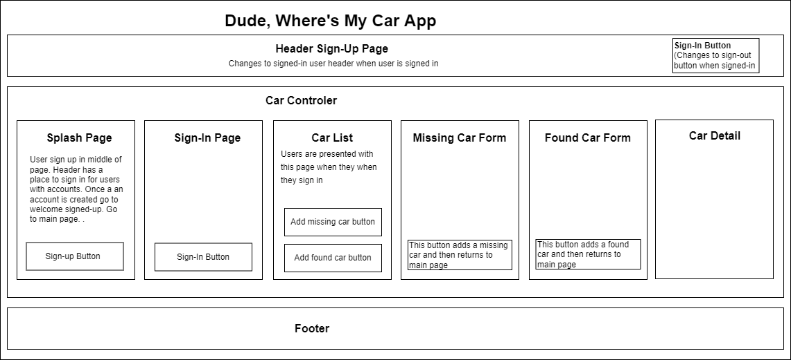

# Dude where's my car? (DWMC for short)

**By Shane Graff**

#### An app for people in the Portland metro area to add stolen and found cars to a database. The idea is for the database and app to help facilitate people finding their cars. 


-------------------------
#### Table of Contents

1. [Technologies Used](#technologies)
2. [Setup/Installation Requirements](#setup)
3. [App Layout](#layout)
4. [Features To Add](#features)
5. [Known Bugs](#bugs)
6. [License](#license)
7. [Contact Information](#contact)

---------------------------
## Technologies Used <a id="technologies"></a>

* JavaScript
* [JSX](https://reactjs.org/docs/introducing-jsx.html) 
* [REACT Framework](https://reactjs.org)
* [Firebase](https://firebase.google.com/docs/database/)
* [Redux](https://redux.js.org/)
* [Npm and Node.js](https://docs.npmjs.com/downloading-and-installing-node-js-and-npm)


---------------------------

## Setup/Installation Requirements <a id="setup"></a>

* You will need npm installed on your machine. Check out the following page: [Npm and Node.js](https://docs.npmjs.com/downloading-and-installing-node-js-and-npm).
* Go to the directory where you'd like to run the project. Run the following command to clone the project into the directory: ```git clone https://github.com/ShanGGraff/dude-wheres-my-car```
* Run ```npm install``` in the root of the project directory.
* Follow these instructions to set up a Firebase account: [Firebase](https://www.learnhowtoprogram.com/react-part-time/react-with-nosql/setting-up-a-firebase-project)
* In the root directory create a file named .env. Make sure that .env is in the .gitignore file in the same directory. It should already be there.
* Add your info from your Firebase account to the .env project. See this page for what the .env file should look like: [.env Example](https://www.learnhowtoprogram.com/react-part-time/react-with-nosql/adding-firebase-to-react)

---------------------------

## DWMC Layout<a id="layout"></a>



----------------------------

## Features to add<a id="features"></a>
* Redirect to sign up page if user tries to signin but has no account
* Redirect to sign in page if user tries to add a car or edit an existing car
* Add an admin account that can add, edit, and delete all cars
* Add authentication so that a signed-in user, other than the admin, can delete or edit only their entry
* Add a way for users to contact each other if they have any info regarding the missing or found car
* Add the ability to upload pictures of the cars to firebase
* Add more styling to all the pages
* Add external resource info on the footer
* Change the CarList page so it can display multiple cars in rows of four and columns of four

## Buglist <a id="bugs"></a>
* No known issues

## License
* [MIT](https://choosealicense.com/licenses/mit/)

Copyright (c) 2022 Creators 

----------------------------

## Contact Information <a id="contact"></a>

* Shane Graff <copellius@gmail.com>
* Github page: [ShanGGraff](https://github.com/ShanGGraff)
* LinkedIn: [Shane Graff](https://www.linkedin.com/in/shanegraff)

---------------